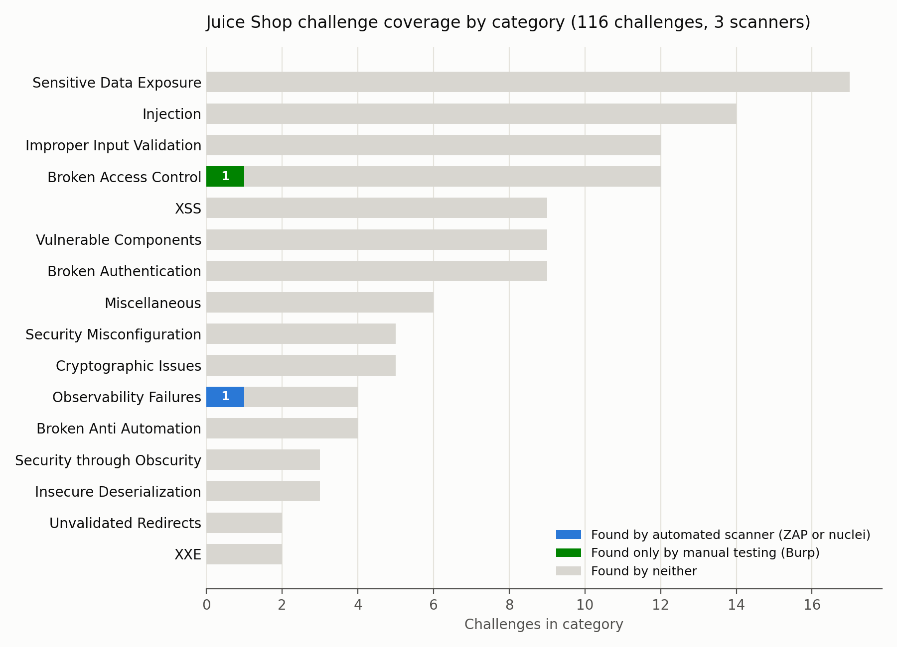

# Web app scanner coverage: what automated scanners find and why they miss the rest

**A scanner is a program that sends many crafted HTTP requests to a web app and
flags responses that match a pattern for a known problem** (an error message, a
missing security header, a string that suggests a vulnerable library). It does
not understand what the app is supposed to do. This project measures exactly
where that limitation shows up, against a target that publishes its own answer
key.

## The number

Out of OWASP Juice Shop's own manifest of **116 vulnerability challenges across
16 categories**, running two automated scanners (OWASP ZAP, both unauthenticated
and logged in, plus nuclei) found challenges that map to **1 of them**: an
exposed Prometheus metrics endpoint. Fifteen minutes of manual testing in Burp
Suite, using only its Proxy and request viewer (Burp's free Community edition
has no automated scanner), found a second: reading another user's shopping
basket by changing one digit in a URL. That leaves 114 of 116 challenges
unmatched by anything run in this project.

That is not a claim that the app has only two real problems. Juice Shop has
116 of them, on purpose, and most require doing something specific (filling in
a form a particular way, chaining two requests together, reading obfuscated
JavaScript) that no scanner in this project was built or configured to do.
The 1-in-116 number is a measurement of what generic, out-of-the-box scanning
against this specific target found, not a ceiling on what any scanner could
ever find with more time or better rules.

## The mechanism, not just the number

A scanner works by sending a request and checking the response against a
pattern: a status code, a string in the body, a missing header. That approach
is good at things that are wrong no matter who is looking at the page: a
missing Content-Security-Policy header, an exposed `/metrics` endpoint, a
Swagger file left public. It found several of those here (see the table
below), even though none of them happened to be one of Juice Shop's scored
challenges.

It structurally cannot do the thing that **Broken Access Control** needs: tell
whether the person making a request is allowed to see what came back. A
request for `GET /rest/basket/8` that returns HTTP 200 with a well-formed
JSON body looks identical whether the caller owns basket 8 or not. There is
no error, no unusual status code, nothing to pattern-match. Finding it
requires two different logged-in identities and a person (or a script written
for this exact purpose) checking whether user A's request for user B's data
should have been refused. That is a **business logic flaw**: the code runs
without crashing and returns a normal-looking answer, the answer is just
wrong for who asked. ZAP's active scan and nuclei's templates both operate
one request, one identity, at a time. An **authenticated scan** (one where the
scanner logs in first and crawls as a real user) does not fix this either,
because it is still only ever one identity at a time. This project ran both
an unauthenticated and an authenticated ZAP scan specifically to test that,
and the authenticated run found nothing the unauthenticated run had not
already found.

Manual testing does not have that limit, because a person decides what "wrong"
looks like for this specific app. That is the actual gap between "automated
scanning" and "manual testing", not a competition between ZAP and Burp: they
run different kinds of checks by design, and Burp Suite's free Community
edition does not even ship an automated scanner to compare against (confirmed
against PortSwigger's own feature list, see FINDINGS.md).

## The coverage table



| Category | Challenges | Found by automated scanner | Found only by manual testing | Found by neither |
|---|---|---|---|---|
| Sensitive Data Exposure | 17 | 0 | 0 | 17 |
| Injection | 14 | 0 | 0 | 14 |
| Improper Input Validation | 12 | 0 | 0 | 12 |
| Broken Access Control | 12 | 0 | 1 | 11 |
| XSS | 9 | 0 | 0 | 9 |
| Vulnerable Components | 9 | 0 | 0 | 9 |
| Broken Authentication | 9 | 0 | 0 | 9 |
| Miscellaneous | 6 | 0 | 0 | 6 |
| Security Misconfiguration | 5 | 0 | 0 | 5 |
| Cryptographic Issues | 5 | 0 | 0 | 5 |
| Observability Failures | 4 | 1 | 0 | 3 |
| Broken Anti Automation | 4 | 0 | 0 | 4 |
| Security through Obscurity | 3 | 0 | 0 | 3 |
| Insecure Deserialization | 3 | 0 | 0 | 3 |
| Unvalidated Redirects | 2 | 0 | 0 | 2 |
| XXE | 2 | 0 | 0 | 2 |

Generated by `scripts/06_score_alerts.py` from `data/challenges.yml` and the
real scan output in `evidence/`. Full reasoning for every row, including which
real scanner findings did NOT map to a scored challenge and why, is in
`FINDINGS.md`.

## What this project does not claim

This is not "OWASP ZAP is bad" or "nuclei is bad." Both tools did exactly what
they are built to do: check for known patterns across a large surface quickly.
The finding is that pattern-matching, by construction, cannot see a flaw that
only exists in the relationship between two things (two user identities, two
requests, a value that should but does not match another value). That
category of flaw needs either a human, or a scanner purpose-built to compare
across sessions, which none of the three tools used here are.

## Target and scope

Target: OWASP Juice Shop (`bkimminich/juice-shop`, MIT licensed, see
`data/LICENSE.juiceshop`), run locally in Docker bound to `127.0.0.1:3000`
only. Nothing else was scanned. Every scan, screenshot, and script is
committed as it was produced; see `FINDINGS.md` for the evidence path behind
every number in this file.

## Repo layout

```
data/         Juice Shop's own challenges.yml and its license (already staged)
scripts/      numbered, idempotent: parse manifest, run each scanner, score, chart
evidence/     raw scan output and screenshots, never hand-edited
evidence/gui/ real ZAP and Burp screenshots
charts/       generated from evidence/scoring/*.csv
tests/        pytest; SKIP (not FAIL) when the container or a scan output is absent
```

## Reproducing this

```
docker run --rm -p 127.0.0.1:3000:3000 bkimminich/juice-shop
python3 scripts/01_parse_manifest.py
# scripts/02 through 05 need the container up; scripts/06 and 07 only need
# the evidence/ files already in this repo.
python3 -m pytest tests/
```
